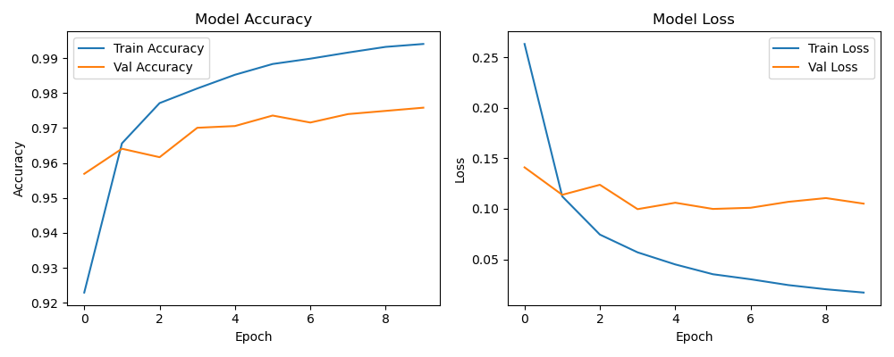
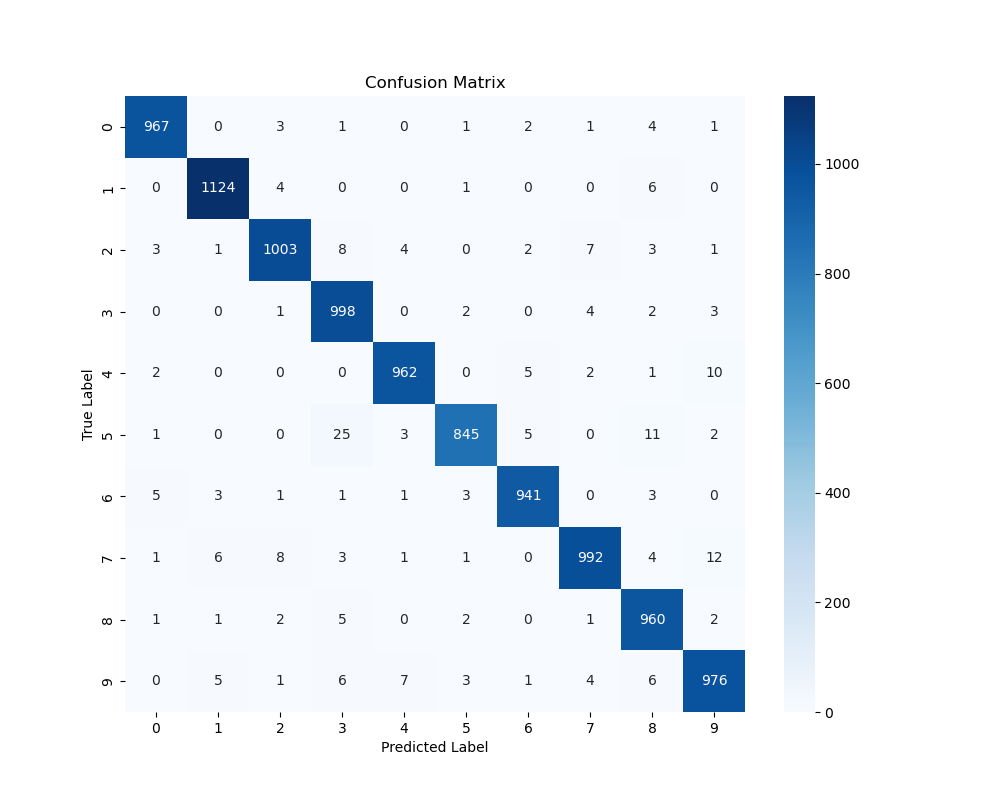
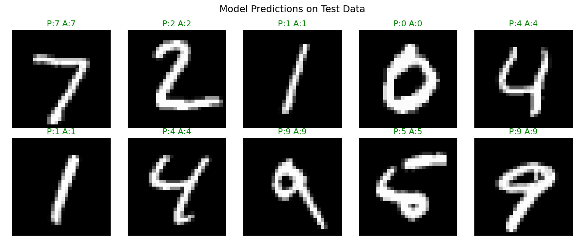

# Handwritten Digit Recognition using ANN

## Overview
A deep learning project to recognize handwritten digits (0-9) using an Artificial Neural Network trained on the MNIST dataset.

## Results
- Test Accuracy: 97.68%
- F1 Score: 0.98 (macro avg)

## Architecture
- Input Layer: 784 neurons
- Hidden Layer 1: 128 neurons (ReLU)
- Hidden Layer 2: 64 neurons (ReLU)
- Output Layer: 10 neurons (Softmax)

## Key Steps
1. Data Loading & Exploration
2. Preprocessing (Normalization, Flattening, One-hot Encoding)
3. ANN Architecture Design
4. Model Training (10 epochs)
5. Evaluation (Confusion Matrix, Precision, Recall, F1)
6. Prediction Visualization

## Tech Stack
- Python
- TensorFlow / Keras
- NumPy, Pandas
- Matplotlib, Seaborn
- Scikit-learn

## Sample Results

